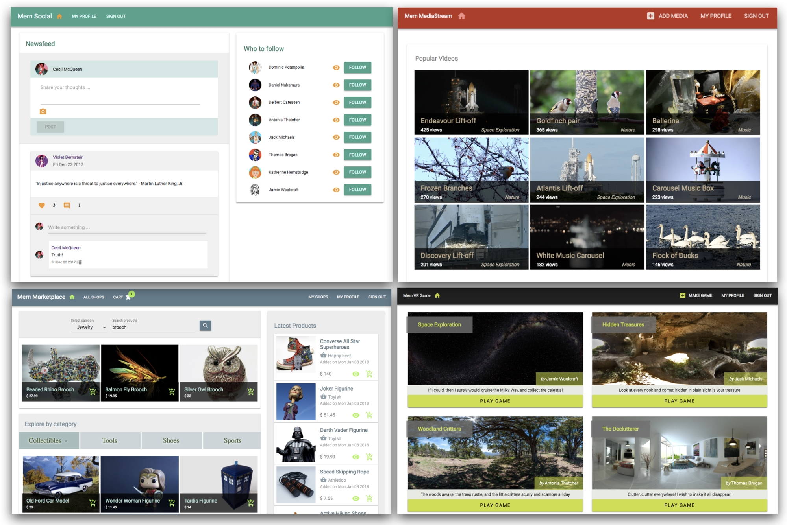

# 1. Unleashing React Applications with MERN

* MERN stack

   * Node

   * Express

   * MongoDB

   * React

* Relevance of MERN

   * Consistency across the technology stack

   * Less time to learn, develop, deploy, and extend

   * Widely adopted in the industry

   * Community support and growth

* Range of MERN applications

   * MERN applications developed in this book

      * Social media platform

      * Online marketplace

      * Media streaming application

      * VR game for the web

* Book structure

   * Getting started with MERN

   * Building MERN from the ground up – a skeleton application

   * Developing basic web applications with MERN

   * Advancing to complex MERN applications

   * Going forward with MERN

* Getting the most out of this book

* Summary

Puede que React haya abierto nuevas fronteras para el desarrollo web frontend y haya cambiado la forma en que programamos las interfaces de usuario de JavaScript, pero aún necesitamos un backend sólido para construir una aplicación web completa. Aunque existen innumerables opciones al seleccionar tecnologías de back-end, los beneficios y el atractivo de usar una pila completa de JavaScript son innegables, especialmente cuando hay tecnologías de back-end robustas y ampliamente adoptadas como Node, Express y MongoDB. La combinación del potencial de React con estas tecnologías del lado del servidor probadas en la industria crea una amplia gama de posibilidades al desarrollar aplicaciones web del mundo real. 

Este libro lo guía a través de la configuración para el desarrollo web basado en MERN, para construir aplicaciones web del mundo real de diversas complejidades. Antes de sumergirnos en el desarrollo de estas aplicaciones web, vamos a responder las siguientes preguntas en este capítulo para establecer el contexto para usar MERN: 

* ¿Qué es MERN stack? 

* ¿Por qué MERN es relevante hoy? 

* ¿Cuándo es una buena ida usar MERN para desarrollar apps web? 

* ¿Cómo se organiza este libro para ayudar a dominar MERN?

## MERN stack

MongoDB, Express, React y Node se utilizan en conjunto para crear aplicaciones web y crear la MERN stack. En esta alineación, Node y Express unen el backend web, MongoDB sirve como la base de datos NoSQL y React crea la interfaz que el usuario ve e interactúa.

Las cuatro tecnologías son gratuitas, de código abierto, multiplataforma y basadas en JavaScript, con un amplio soporte de la comunidad y la industria. Cada tecnología tiene un conjunto único de atributos, que cuando se integran juntos forman full JavaScript stack simple pero efectiva para el desarrollo web.

### Node

Node se desarrolló como un JavaScript runtime environment integrado en el motor V8 JavaScript de Chrome. Node hizo posible comenzar a usar JavaScript en el lado del servidor para crear una variedad de herramientas y aplicaciones más allá de los casos de uso anteriores que se limitaban dentro de un navegador.

Node tiene una arquitectura controlada por eventos capaz de I/O asíncrona sin bloqueo. Su exclusivo modelo de I/O sin bloqueo elimina el enfoque de espera para atender solicitudes. Esto permite crear aplicaciones web en tiempo real escalables y livianas que pueden manejar eficientemente muchas solicitudes.

El sistema de administración de paquetes predeterminado de Node, el administrador de paquetes de Node o npm, viene incluido con la instalación de Node. Npm da acceso a cientos de miles de paquetes Node reutilizables creados por desarrolladores de todo el mundo y se jacta de que actualmente es el ecosistema más grande de bibliotecas de código abierto en el mundo.

*Obtenga más información sobre Node en https://nodejs.org/en/ y explore los módulos npm disponibles en https://www.npmjs.com/.*

### Express

Express es un marco básico para crear aplicaciones web y APIs con un servidor Node. Proporciona una capa simple de características fundamentales de la aplicación web que complementa Node.

En cualquier aplicación web desarrollada con Node, Express se puede usar como un framework web de enrutamiento y middleware que tiene una funcionalidad mínima propia: una aplicación Express es esencialmente una serie de llamadas a funciones middleware.

*Las **Middleware** son funciones que tienen acceso a los objetos HTTP request y response, y también a la siguiente función middleware en el ciclo de solicitud-respuesta de la aplicación web.* 

Es posible insertar casi cualquier middleware compatible de su elección en la cadena de manejo de solicitudes, en casi cualquier orden, haciendo que Express sea muy flexible para trabajar.

*Descubra lo que es posible con Express.js en http://expressjs.com*.

### MongoDB

MongoDB es la mejor opción cuando se decide por una base de datos NoSQL para cualquier aplicación. Es una base de datos orientada a documentos que almacena datos en documentos flexibles similares a JSON. Esto significa que los campos pueden variar de un documento a otro y que los modelos de datos pueden evolucionar con el tiempo en respuesta a los requisitos cambiantes de la aplicación.

Las aplicaciones que priorizan la disponibilidad y la escalabilidad se benefician de las características de arquitectura distribuida de MongoDB. Viene con soporte incorporado para alta disponibilidad, escala horizontal mediante fragmentación y escalabilidad de centros de datos múltiples a través de distribuciones geográficas.

MongoDB tiene un lenguaje de consulta expresivo, que permite consultas ad hoc, indexación para búsquedas rápidas y agregación en tiempo real que proporciona formas poderosas de acceder y analizar datos mientras mantiene el rendimiento incluso cuando el tamaño de los datos crece exponencialmente.

*Explore las características y servicios de MongoDB en https://www.mongodb.com/.*

### React

**React es una biblioteca JavaScript declarativa y basada en componentes para construir interfaces de usuario**. Su naturaleza declarativa y modular facilita a los desarrolladores crear y mantener interfaces de usuario reutilizables, interactivas y complejas.

Las aplicaciones grandes que muestran una gran cantidad de datos cambiantes pueden ser rápidas y receptivas si se crean con React, ya que se encarga de actualizar y representar eficientemente los componentes de la interfaz de usuario correctos cuando cambian datos específicos. React realiza esta representación eficiente con su notable implementación de un DOM virtual, que diferencia a React de otras bibliotecas de IU web que manejan actualizaciones de página con manipulaciones costosas directamente en el DOM del navegador.

El desarrollo de interfaces de usuario con React también obliga a los programadores frontend a escribir código bien razonado y modular que sea reutilizable, más fácil de depurar, probar y ampliar.

*Consulte los recursos en React en https://reactjs.org/.*

Dado que las cuatro tecnologías están basadas en JavaScript, estas están inherentemente optimizadas para la integración. Sin embargo, la forma en que realmente se combinan en la práctica para formar la pila MERN puede variar según los requisitos de la aplicación y las preferencias del desarrollador, lo que hace que MERN sea personalizable y extensible a necesidades específicas.

## Relevancia de MERN

JavaScript ha recorrido un largo camino desde su inicio y está en constante crecimiento. Las tecnologías de pila MERN han desafiado el status quo y han abierto nuevos caminos para lo que es posible con JavaScript. Pero cuando se trata de desarrollar aplicaciones del mundo real que necesitan ser sostenibles, ¿es una opción digna? Algunas de las razones que justifican la elección de MERN para su próxima aplicación web se describen brevemente a continuación.

### Consistencia en el stack de tecnología

Como JavaScript se usa en todo momento, los desarrolladores no necesitan aprender y cambiar de marcha con frecuencia para trabajar con tecnologías muy diferentes. Esto también permite una mejor comunicación y comprensión entre los equipos que trabajan en diferentes partes de la aplicación web.

### Menos tiempo para aprender, desarrollar, implementar y extender

La coherencia en la stack también facilita el aprendizaje y el trabajo con MERN, lo que reduce la sobrecarga de adoptar una nueva stack y el tiempo para desarrollar un producto que funcione. Una vez que se configura la base de trabajo de una aplicación MERN y se establece un flujo de trabajo, se requiere menos esfuerzo para replicar, desarrollar y ampliar cualquier aplicación.

### Ampliamente adoptado en la industria

Las organizaciones de todos los tamaños han estado adoptando las tecnologías en esta stack en función de sus necesidades porque pueden crear aplicaciones más rápido, manejar requisitos muy diversos y administrar aplicaciones de manera más eficiente a escala.

### Apoyo y crecimiento de la comunidad.

Las comunidades de desarrolladores que rodean las tecnologías de stack MERN muy populares son bastante diversas y crecen regularmente. Con muchas personas que usan, reparan, actualizan y están dispuestas a ayudar a hacer crecer estas tecnologías, el sistema de soporte seguirá siendo fuerte en el futuro previsible. Estas tecnologías continuarán manteniéndose y es muy probable que los recursos estén disponibles en términos de documentación, bibliotecas complementarias y soporte técnico.

La facilidad y los beneficios de usar estas tecnologías ya son ampliamente reconocidos. Debido a las compañías de alto perfil que continúan adoptando y adaptando, y al creciente número de personas que contribuyen a las bases del código, brindan soporte y crean recursos, las tecnologías en la stack MERN seguirán siendo relevantes durante mucho tiempo.

## Gama de aplicaciones MERN

Dadas las características únicas atribuidas a cada tecnología, junto con la facilidad de ampliar las funcionalidades de esta stack mediante la integración de otras tecnologías, la gama de aplicaciones que se pueden construir con esta stack es en realidad bastante diversa.

En la actualidad, se espera que, por defecto, las aplicaciones web sean aplicaciones de cliente enriquecidas que sean inmersivas, interactivas y no se queden cortas en rendimiento y disponibilidad. La agrupación de las fortalezas de MERN lo hace perfecto para desarrollar aplicaciones web que cumplan estos mismos aspectos y demandas.

Además, los atributos novedosos y futuros de algunas de estas tecnologías, como la manipulación de operaciones de bajo nivel con Node, las capacidades de transmisión de archivos grandes con MongoDB GridFS y las características de realidad virtual en la web que usan React 360, hacen posible construir aún más complejo y Aplicaciones únicas con MERN.

Puede parecer razonable elegir características específicas en las tecnologías MERN y discutir por qué no funcionan para ciertas aplicaciones. Pero dada la naturaleza versátil de cómo una stack MERN puede unirse y extenderse; Estas inquietudes pueden abordarse en MERN caso por caso. En este libro, demostraremos cómo hacer tales consideraciones cuando nos enfrentamos a requisitos y demandas específicos en la aplicación que se está creando.

### Aplicaciones MERN desarrolladas en este libro

Para demostrar la amplitud de posibilidades con MERN y cómo puede comenzar fácilmente a construir una aplicación web con diversas características, este libro mostrará aplicaciones web de uso diario junto con experiencias web complejas y raras:

La captura de pantalla anterior da una idea de las cuatro aplicaciones diferentes de MERN desarrolladas en el resto de este libro.

#### Social media platform (Plataforma de redes sociales)

Para la primera aplicación MERN, crearemos una aplicación básica de redes sociales inspirada en Twitter y Facebook. Esta plataforma de redes sociales implementará características simples como compartir publicaciones, dar me gusta y comentar, seguir a amigos y una fuente de noticias agregada.

#### Online marketplace (Mercado en línea)

Las aplicaciones web de comercio electrónico de todo tipo abundan en Internet, y no pasarán de moda pronto. Con MERN, crearemos una aplicación de mercado en línea que cubra aspectos centrales, como soporte para cuentas de vendedor, listados de productos, un carrito de compras para clientes y procesamiento de pagos.

#### Media streaming application (Aplicación de transmisión de medios)

Para probar algunas capacidades avanzadas de MERN, una aplicación más inmersiva, como una aplicación de transmisión de medios, es la siguiente opción. Inspirada en las funciones de Netflix y YouTube, esta aplicación implementará capacidades de carga y visualización de contenido con una función de carga de contenido multimedia para proveedores de contenido y transmisión de contenido en tiempo real para los espectadores.

#### VR game for the web (Juego de realidad virtual para la web)

El lanzamiento de React 360 hace posible aplicar capacidades de realidad virtual web a las interfaces de usuario de React. Exploraremos cómo crear experiencias web raras con React 360 en MERN al crear una aplicación básica de juegos de realidad virtual para la web. Los usuarios podrán crear y jugar juegos de realidad virtual, donde cada juego tendrá objetos animados de realidad virtual que el jugador puede recoger para completar el juego.

## Estructura del libro

Este libro tiene como objetivo ayudar a los desarrolladores de JavaScript que tienen una experiencia de cero a algo con la stack MERN, a configurar y comenzar a desarrollar aplicaciones web de diversa complejidad. Incluye pautas para construir y ejecutar las diferentes aplicaciones complementadas con fragmentos de código y explicaciones de conceptos clave.

El libro está organizado en cinco partes, progresando de temas básicos a avanzados, llevándote en un viaje de construir MERN desde cero, luego usándolo para desarrollar diferentes aplicaciones con características simples a complejas, mientras demuestra cómo extender las capacidades de stack MERN basada en los requisitos de la aplicación.

### Comenzando con MERN

El Capítulo 1, Liberación de aplicaciones de React con MERN y el Capítulo 2, Preparación del entorno de desarrollo establecen el contexto para desarrollar aplicaciones web en una stack MERN y lo guían a través de la configuración de su entorno de desarrollo.

### Construyendo MERN desde cero - una aplicación esqueleto

El Capítulo 3, Creación de un backend con MongoDB, Express y Node, y el Capítulo 4, Agregar una interfaz React para completar MERN muestran cómo unir las tecnologías de stack MERN para formar una aplicación web esqueleto con características mínimas y básicas. Esta esquelética aplicación MERN actúa como base para las cuatro aplicaciones principales desarrolladas en el resto del libro.

### Desarrollo de aplicaciones web básicas con MERN

En esta parte, se familiarizará con los atributos centrales de una aplicación web MERN stack al desarrollar dos aplicaciones del mundo real: una social media platform simple en el Capítulo 5, *Comenzando con una aplicación social media platform  simple*, y un online marketplace en el Capítulo 6, *Ejercicio de nuevas habilidades MERN con un Online Marketplace y Capítulo 7, Ampliación del Marketplace para pedidos y pagos.

### Avanzar a aplicaciones complejas MERN

El Capítulo 8, *Media Streaming Application*, Capítulo 9, *Personalización del reproductor multimedia y mejora del SEO*, Capítulo 10, *Desarrollo de un Web-Based VR Game, basado en la web*, y Capítulo 11, *Hacer dinámico el VR Game usando MERN* muestran cómo se puede usar esta stack para desarrollar aplicaciones con características más complejas e inmersivas, como transmisión de medios y realidad virtual con React 360.

### Avanzando con MERN

Finalmente, el Capítulo 12, *Siguiendo las mejores prácticas y desarrollando MERN*, resume los capítulos anteriores y las aplicaciones desarrolladas al expandir las mejores prácticas a seguir para hacer aplicaciones MERN exitosas, sugiriendo mejoras y desarrollos adicionales.

Puede optar por utilizar el libro fuera del orden prescrito en función de su nivel de experiencia y preferencia. Un desarrollador que es muy nuevo en MERN puede seguir el camino establecido en el libro. Para un desarrollador JS más experimentado, los capítulos en el Building MERN desde cero: una sección de aplicación esqueleto sería un buen lugar para comenzar a configurar la aplicación base, luego elegir cualquiera de las cuatro aplicaciones para construir y extender.

